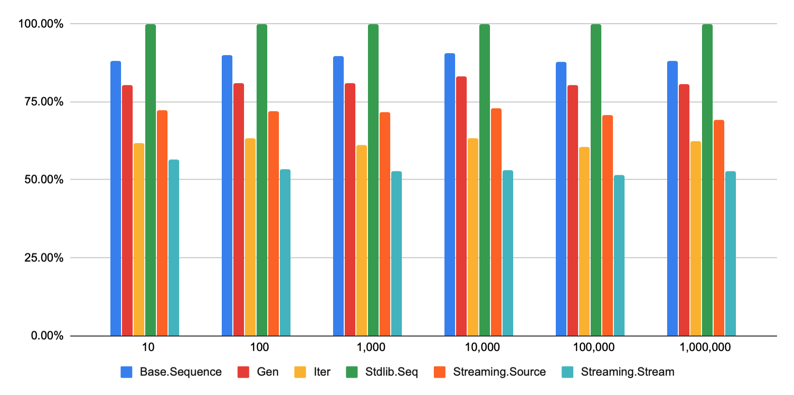

# Streams Benchmarks

An ongoing effort to understand and document the performance characteristics of streaming models available for OCaml.


## Results

The results for the benchmarks presented here were run on a MacBook Pro with the **2.6 GHz 6-Core Intel Core i7** CPU.

The benchmarks were built with the flambda variant of the 4.10 compiler with th `-unbox-closures -O3` flags.

The table below contains normalized execution times for a benchmark that combines the following operations: `unfold`, `map`, `filter`, `take`, `flat_map` and `fold`. The code can be found in `src/Cases.ml`. Only some of the modesl are included in the benchmark results below.

  
|Input length|Streaming.Source| Gen    |Base.Sequence|Stdlib.Seq|Streaming.Stream| Iter   |
|------------|----------------|--------|-------------|----------|----------------|--------|
| 10         | 72.24%         | 80.41% | 88.12%      | 100.00%  | 56.57%         | 61.61% |
| 100        | 71.95%         | 80.89% | 89.91%      | 100.00%  | 53.43%         | 63.19% |
| 1,000      | 71.75%         | 81.13% | 89.60%      | 100.00%  | 52.88%         | 61.02% |
| 10,000     | 72.81%         | 83.24% | 90.59%      | 100.00%  | 52.96%         | 63.44% |
| 100,000    | 70.72%         | 80.36% | 87.80%      | 100.00%  | 51.51%         | 60.41% |
| 1,000,000  | 69.32%         | 80.53% | 88.02%      | 100.00%  | 52.63%         | 62.49% |



> Lower values mean faster execution time.

 Detailed benchmark results for different operations can be found [here](https://docs.google.com/spreadsheets/d/1OdlEwwunb4ibhHgkwR0I4cRIgOIOHqXRZTtxtoTd6JE/edit?usp=sharing).

## Implemented models

All the models presented here were implemented from scratch in this repository
to provide a clean reproducible environment and consisten compilation flags.

### `Stdlib.Seq` (`Pull_thunk_list`)
Model used in [Stdlib.Seq](https://github.com/ocaml/ocaml/blob/4.10/stdlib/seq.mli). This is an iterator similar to lists albeit lazy,
protected with a thunk.

```ocaml
type +'a node =
  | Nil
  | Cons of 'a * 'a t

and 'a t = unit -> 'a node
```

### `Streaming.Source` (`Pull_cursor`, `Pull_cursor_k` and `Pull_cursor_safe`)
Model used in [Streaming.Source](https://github.com/odis-labs/streaming).
Iterators based on the "unfold" function. They put an explicit state in the
type making them easy to implement and reason about. The `_k` and `_safe`
variants attempt to implement them using CPS and add resource handling.

```ocaml
(* Pull_cursor *)
type +'a t = Iter : 's * ('s -> ('a * 's) option) -> 'a t

(* Pull_cursor_k *)
type ('a, 's) iter = {
  init : 's;
  next : 'r . ('a -> 's -> 'r) -> 's -> (unit -> 'r) -> 'r;
}
type 'a t = Iter : ('a, 's) iter -> 'a t

(* Pull_cursor_safe *)
type 'a t =
  Iter : {
    init : unit -> 's;
    next : 'r . ('a -> 's -> 'r) -> (unit -> 'r) -> 's -> 'r;
    stop : 's -> unit;
  } -> 'a t
```

### `Gen` (`Pull_option`)
Model used in [Gen](https://github.com/c-cube/gen). This is a simple pull iterator similar in spirit to `Pull_cursor` but without explicit state. The implementation of combinators is forced to used mutable state for control management.

## Base.Sequence (`Pull_stream_fusion`)
Model used in
[Base.Sequence](https://github.com/janestreet/base/blob/v0.14.0/src/sequence.mli).
This iterator is very well known for being used as a "stream fusion" mechanism
for Haskell lists. It is structurally similar to `Pull_cursor` but has an extra
variant for skipping elements.

```ocaml
type ('a, 's) step =
  | Done
  | Skip  of 's
  | Yield of 'a * 's
type +_ t =
  Stream : 's * ('s -> ('a, 's) step) -> 'a t
```

### `Streaming.Stream` (`Push_reducer_bool` and `Push_reducer_stop`)
Model used in [Streaming.Stream](https://github.com/odis-labs/streaming). A
push-based iterator with great performance and built-in resource handling. This
implementation is inspired by Clojure's transducers. It can be thought of as
"fold fusion with resource handling" The `Push_reducer_stop` variant encodes
termination in reducers as a variant value instead of using a boolean.

```ocaml
(* Push_reducer_bool *)
type ('a, 'b) reducer =
  Reducer : {
    init : unit -> 'acc;
    step : 'acc -> 'a -> 'acc;
    full : 'acc -> bool;
    stop : 'acc -> 'b;
  } -> ('a, 'b) reducer
type 'a t =
  { reduce : 'r . ('a, 'r) reducer -> 'r }


type 'a reduced = Done of 'a | Continue of 'a
type ('a, 'r) reducer =
  Reducer : {
    init : 's;
    step : 'a -> 's -> 's reduced;
    stop : 's -> 'r;
  } -> ('a, 'r) reducer
type 'a t = { run : 'r . ('a, 'r) reducer -> 'r}
```

### `Push_fold_stop`
A fold with termination that can be fused to created nested computations that
form streams. Similar in spirit to `Push_reducer_bool`, but lacks resource
handling. Writing combinators in this style is somewhat complicated.

```ocaml
type 'a t = { run : 'r . ('r -> 'a -> 'r option) -> 'r -> 'r }
```


### Iter (`Push_unit`)
Model used in [Iter](https://github.com/c-cube/iter). This is a very simple
push-based iterator. It has excellent performance and supports efficient
concatentation and unzipping. Its minimal interface imposes the use mutations
and exceptions for control management. It also lacks support for resource
handling.

```ocaml
type 'a t = ('a -> unit) -> unit
```

## Running the benchmarks

The benchmarks are configured with environment variables:

```
- STREAMS_BENCHMARK=all|all_no_flat_map|all_no_take|fold|map|filter|flat_map|take
- STREAMS_LENGTH=int (input length)
- STREAMS_LIMIT=int (used for take)
```

Run the benchmark with:

```
$ (export STREAMS_BENCHMARK=all; \
   export STREAMS_LENGTH=500000; \
   export STREAMS_LIMIT=250000; \
   opam exec --switch=4.10.0+flambda -- dune exec -- ./src/Cmd_core_bench.exe -quota 10 -ascii)

benchmark=all length=500000 limit=250000
Estimated testing time 1m (6 benchmarks x 10s). Change using '-quota'.

  Name               Time/Run    mWd/Run     mjWd/Run     Prom/Run   Percentage
 ------------------ ---------- ---------- ------------ ------------ ------------
  Streaming.Source    44.61ms    79.00Mw    2_829.65w    2_829.65w       70.47%
  Gen                 51.50ms    41.67Mw    2_361.78w    2_361.78w       81.36%
  Base.Sequence       55.85ms   100.17Mw    5_800.13w    5_800.13w       88.23%
  Stdlib.Seq          63.30ms   130.33Mw   13_329.49w   13_329.49w      100.00%
  Streaming.Stream    31.88ms    32.00Mw    1_785.02w    1_785.02w       50.36%
  Iter                45.66ms    30.00Mw      782.29w      782.29w       72.13%
```

